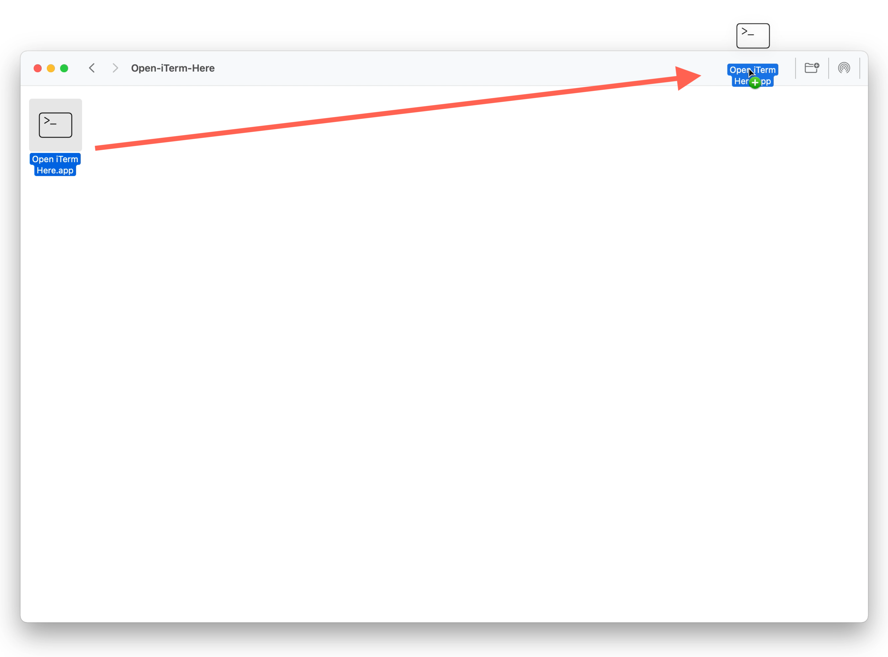

# Open iTerm Here
Open iTerm in the current finder location.

## Where to download?
You can download the latest app [Here](https://github.com/dyckia/open-iterm-here/releases/tag/v1.1).

## How to use?
1. Unzip the file and move the app to the Application folder.
2. `Command + Drag` the app to the toolbar of the Finder window.
3. Click the app icon in the toolbar to open the current path in iTerm.

